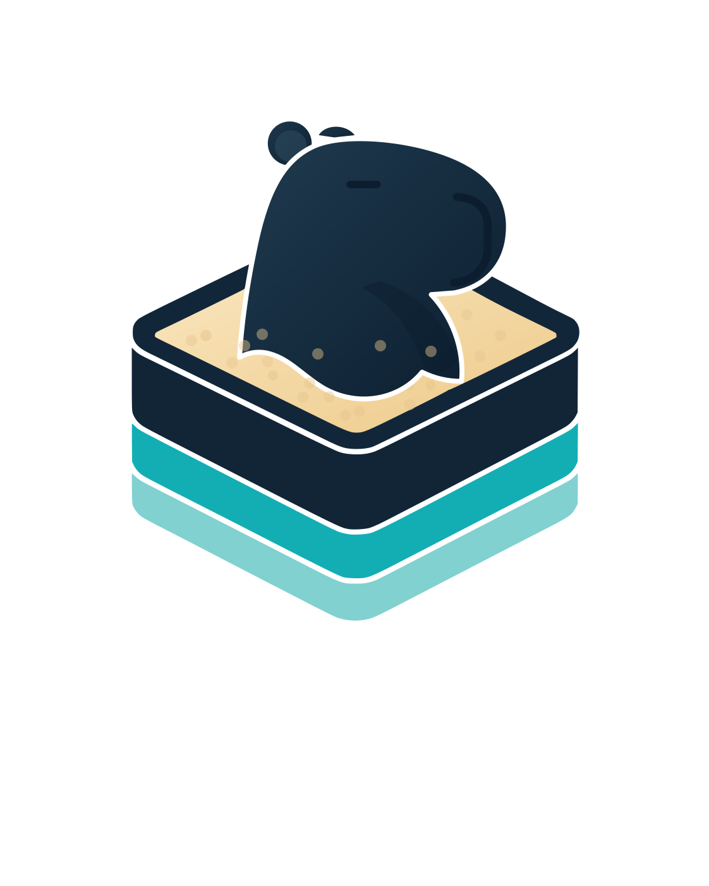

<div align="center">
  
</div>

# capy

**C**ontext-**A**ware **P**rompting ...or "**Y**et another solution to LLM context problem"

[](https://github.com/serpro69/capy/stargazers) [](https://github.com/serpro69/capy/network/members) [](https://github.com/serpro69/capy/commits) [](LICENSE)

> [!IMPORTANT]
> This project was created with the help of Claude-Code. It is, however, reviewed, tested, and reworked with a human-in-the-loop.
>
> No AI slop here. Purely AI-made skills are hot garbage, and that's putting it mildly.
>
> That said, if you have any problems with code that is written by AI - you've been warned. But, then again, why would you be interested in AI-related configs and skills in the first place... `¯\_(ツ)_/¯`

## ToC

<!--toc:start-->
- [Privacy & Architecture](#privacy--architecture)
- [The Problem](#the-problem)
- [Benchmarks](#benchmarks)
  - [Retrieval Quality](#retrieval-quality)
  - [Context Reduction](#context-reduction)
- [Quick Start](#quick-start)
  - [Install](#install)
  - [Setup](#setup)
  - [Setup (Codex CLI)](#setup-codex-cli)
- [How It Works — By Example](#how-it-works--by-example)
  - [Before capy](#before-capy)
  - [After capy](#after-capy)
  - [The `intent` parameter](#the-intent-parameter)
- [Configuration](#configuration)
- [Encryption](#encryption)
  - [Setup](#setup-1)
  - [Initial encryption](#initial-encryption)
  - [Cross-machine sync](#cross-machine-sync)
  - [Keeping the DB out of your project repo (recommended)](#keeping-the-db-out-of-your-project-repo-recommended)
  - [Key rotation](#key-rotation)
  - [Passphrase recommendations](#passphrase-recommendations)
- [Session Vault](#session-vault)
  - [Setup](#setup-2)
  - [Quick start](#quick-start-1)
  - [Archiving sessions](#archiving-sessions)
  - [Codex sessions](#codex-sessions)
  - [Commands](#commands)
  - [Restore and resume](#restore-and-resume)
  - [Naming sessions](#naming-sessions)
  - [Cross-machine sync](#cross-machine-sync-1)
  - [Key rotation](#key-rotation-1)
  - [Storage and limits](#storage-and-limits)
  - [Environment variables](#environment-variables)
- [CLI Commands](#cli-commands)
  - [Shell Completions](#shell-completions)
- [MCP Tools](#mcp-tools)
  - [Execution](#execution)
  - [Knowledge](#knowledge)
  - [Utility](#utility)
- [Security](#security)
  - [Sandbox protections](#sandbox-protections)
- [Hook System](#hook-system)
  - [What gets intercepted](#what-gets-intercepted)
  - [Platform support](#platform-support)
- [Troubleshooting](#troubleshooting)
- [Acknowledgements](#acknowledgements)
- [Contributing](#contributing)
- [License](#license)
<!--toc:end-->

## Privacy & Architecture

`capy` is not a CLI output filter or a cloud analytics dashboard. It operates at the MCP protocol layer — raw data stays in a sandboxed subprocess and never enters your context window. Web pages, API responses, file analysis, log files — everything is processed in complete isolation.

**Nothing leaves your machine.** No telemetry, no cloud sync, no usage tracking, no account required. Your code, your prompts, your session data — all local. The SQLite databases live in your home directory and are encrypted at rest. The encryption key (`CAPY_DB_KEY`) never leaves your environment.

This is a deliberate architectural choice, not a missing feature. Context optimization should happen at the source, not in a dashboard behind a per-seat subscription. Privacy-first is our philosophy — and every design decision follows from it. [License](#license)

## The Problem

Every MCP tool call dumps raw data into your context window. A single API response costs 56 KB. Twenty GitHub issues cost 59 KB. One access log — 45 KB. After 30 minutes, 40% of your context is gone. And when the agent compacts the conversation to free space, it forgets which files it was editing, what tasks are in progress, and what you last asked for. The sessions themselves are disposable, too — Claude Code deletes them after 30 days, `/compact` rewrites them in place, and nothing survives across projects or an accidental delete.

`capy` is an MCP server and Claude Code plugin that addresses every layer of this — from the live context window down to the permanence of the sessions themselves:

1. **Context Saving** — Sandbox tools keep raw data out of the context window. 315 KB becomes 5.4 KB. ~98% reduction.
2. **Searchable Knowledge Base** — All sandboxed output is indexed into SQLite FTS5 with BM25 ranking. Use `capy_search` to retrieve specific sections on demand. Multi-layer search: Porter stemming, trigram substring, fuzzy Levenshtein correction, with Reciprocal Rank Fusion and proximity reranking.
3. **Session Memory** — Past conversation transcripts are automatically indexed on server start. When the conversation compacts, the LLM can search prior sessions for context via BM25 search.
4. **Session Vault** — A durable, cross-project, encrypted archive of every Claude Code session. Search, view, restore, or resume past conversations long after Claude Code's 30-day cleanup, compaction, or accidental deletion would have lost them. See [Session Vault](#session-vault).

## Benchmarks

capy ships with a benchmark suite that validates its claims with deterministic, reproducible metrics — no LLM-in-the-loop evaluation. Run `make bench` to reproduce on your machine. Measured across 156 synthetic test cases spanning 5 content types (markdown, JSON, plaintext, transcripts, curated knowledge).

### Retrieval Quality

| Metric                                      | Score |
| ------------------------------------------- | ----- |
| R@1 (at least one relevant result in top 1) | 0.897 |
| R@5                                         | 0.987 |
| R@10                                        | 0.994 |
| MRR (mean reciprocal rank)                  | 0.938 |
| NDCG@10                                     | 0.950 |

### Context Reduction

"Bytes saved" is a vanity metric. NIAH measures whether specific facts survive compression — not just how many bytes were removed:

| Metric                                                | Score |
| ----------------------------------------------------- | ----- |
| Compression Ratio                                     | 49.8% |
| Context Recall (fraction of specific facts preserved) | 0.983 |
| Perfect Recall Rate (cases with all facts preserved)  | 97.1% |
| Effective Compression (compression x recall)          | 49.7% |

On realistic content, capy achieves ~50% compression while preserving ~98% of the specific information needed. The "~98% reduction" claim in the problem statement above applies to raw byte savings on large uniform outputs — the NIAH numbers are the honest picture for information preservation on diverse content.

Full results with per-content-type breakdowns, methodology, and known limitations: [`benchmark/RESULTS.md`](benchmark/RESULTS.md)
Cross-tool comparison: [`benchmark/COMPARISON.md`](benchmark/COMPARISON.md)
Fixture authoring guide: [`benchmark/FIXTURES.md`](benchmark/FIXTURES.md)

## Quick Start

### Install

**Homebrew** (macOS/Linux):

```bash
brew install serpro69/tap/capy
```

**Shell script** (any Unix):

```bash
curl -sSfL https://raw.githubusercontent.com/serpro69/capy/master/install.sh | sh
```

**Build from source** (requires Go 1.25+ and a C compiler):

```bash
git clone https://github.com/serpro69/capy.git
cd capy
make build
mv capy /usr/local/bin/   # or anywhere on your PATH
```

### Setup

**1. Set an encryption key** (required — capy refuses to start without it):

```bash
export CAPY_DB_KEY=$(openssl rand -base64 48)
echo "export CAPY_DB_KEY='$CAPY_DB_KEY'" >> ~/.zshrc  # or ~/.bashrc
```

**2. Configure your project** (Claude Code):

```bash
capy setup
capy doctor   # verify everything is green
```

**3. Use normally.** Start using Claude Code — capy works automatically:

- **Bash commands** producing large output are nudged toward the sandbox
- **curl/wget** calls are intercepted and redirected to `capy_fetch_and_index`
- **WebFetch** is blocked in favor of `capy_fetch_and_index`
- **Read** for analysis (not editing) is nudged toward `capy_execute_file`
- **Subagents** get routing instructions injected automatically
- **Past sessions** are indexed on server start for cross-session search

You don't need to call capy tools yourself. The LLM learns the routing from the hooks and CLAUDE.md instructions that `capy setup` installed. But you can ask it directly: "use capy_batch_execute to research X" if you want to be explicit.

### Setup (Codex CLI)

```bash
capy setup --platform codex
capy doctor
```

## How It Works — By Example

### Before capy

```
You: "Check what's failing in the test suite"
Claude: *runs `npm test` via Bash*
→ 89 KB of test output floods context
→ Context is 40% full after one command
```

### After capy

```
You: "Check what's failing in the test suite"
Claude: *runs capy_batch_execute with commands=["npm test"] and queries=["failing tests", "error messages"]*
→ 89 KB stays in sandbox, indexed into knowledge base
→ Only 2.1 KB of matched sections enter context
→ Claude sees: "3 sections matched 'failing tests' (1,847 lines, 89.2KB)"
```

### The `intent` parameter

When `capy_execute` or `capy_execute_file` is called with an `intent` parameter and the output exceeds 5 KB, capy automatically:

1. Indexes the full output into the knowledge base
2. Searches for sections matching the intent
3. Returns section titles + previews instead of the full output

```
capy_execute(language: "shell", code: "git log --oneline -100", intent: "recent authentication changes")
→ Full git log stays in sandbox
→ Returns: "4 sections matched 'recent authentication changes'"
→ Use capy_search to drill into specific sections
```

## Configuration

capy uses TOML configuration with three-level precedence (lowest to highest):

1. `~/.config/capy/config.toml` (global)
2. `.capy/config.toml` (project)
3. `.capy.toml` (project root)

```toml
[store]
# path = ".capy/knowledge.db"  # optional override; default: ~/.local/share/capy/<project-hash>/knowledge.db
# title_weight = 2.0           # BM25 title column weight
# max_source_bytes = 2097152   # 2 MB hard cap on total content per source

[store.cleanup]
cold_threshold_days = 30
ephemeral_ttl_hours = 24    # lifetime for ephemeral sources (minimum 1)
session_ttl_days = 60       # lifetime for session transcript sources (minimum 1)
auto_prune = false

[store.cache]
fetch_ttl_hours = 24        # skip re-fetch within this window

[executor]
timeout = 30               # seconds
max_output_bytes = 102400  # 100 KB

[server]
log_level = "info"

[vault]
min_session_bytes = 0      # minimum size for new archives; 0 disables
```

All settings have sensible defaults. Configuration files are optional — capy works out of the box.

> **Caution with git and the knowledge DB.** SQLite WAL sidecar files (`.db-wal`, `.db-shm`) are created when the DB is written to during a session. capy flushes the WAL on session close automatically, but the files only get cleaned up if the session actually wrote to the DB. If you see stale WAL files (e.g., after upgrading capy or after an unclean shutdown), run `capy checkpoint` to flush them manually. If you want to commit the DB to git (e.g., to share across machines), run `capy checkpoint` first — it flushes the WAL into the main file and removes the sidecar files.

## Encryption

The knowledge database is encrypted at rest using sqlite3mc (SQLCipher v4 compatible). capy refuses to start without a passphrase.

### Setup

Set `CAPY_DB_KEY` in your shell profile:

```bash
# Generate a strong passphrase (32+ characters recommended)
export CAPY_DB_KEY=$(openssl rand -base64 48)
echo "export CAPY_DB_KEY='$CAPY_DB_KEY'" >> ~/.zshrc  # or ~/.bashrc
```

Or use [direnv](https://direnv.net/) for per-project keys:

```bash
echo "export CAPY_DB_KEY='your-passphrase-here'" >> .envrc
direnv allow
```

### Initial encryption

Existing unencrypted databases must be encrypted before capy will use them:

```bash
export CAPY_DB_KEY='your-passphrase-here'
capy encrypt
# When prompted for the current passphrase, press Enter (empty = unencrypted).
```

The original database is preserved as `<path>.bak`.

### Cross-machine sync

By default, the knowledge DB lives under `~/.local/share/capy/` (XDG data), which is outside git. To enable cross-machine sync, configure a project-local path first:

```toml
# .capy.toml (or .capy/config.toml)
[store]
path = ".capy/knowledge.db"
```

Then encrypt, checkpoint, and commit:

```bash
capy encrypt       # encrypt if not already done
capy checkpoint    # flush WAL into main file
git add .capy/knowledge.db
git commit -m "Update knowledge base"
git push
```

On the other machine (same `store.path` config must be present):

```bash
git pull
export CAPY_DB_KEY='same-passphrase'
capy serve         # DB opens with your key
```

The pre-commit hook rejects unencrypted databases automatically — run `capy encrypt` first if the commit is blocked. It also **blocks the commit if the checkpoint fails** (e.g. the MCP server is still holding the DB): the `capy setup` wrapper propagates real exit codes for every subcommand except `hook` events, so a busy checkpoint now fails the commit instead of silently committing a stale file. Stop the session (or wait for the server to release the DB) and re-commit.

> **Git worktrees.** With a project-scoped `store.path`, sessions running in a [git
> worktree](https://git-scm.com/docs/git-worktree) automatically use the **main**
> worktree's DB instead of a per-worktree copy — so worktree knowledge persists to
> the shared `.capy/knowledge.db` and never produces an unresolvable binary merge
> conflict. Detection reads the worktree's `.git` file directly (no `git` required).
> CLI commands (`capy sweep`, `cleanup`, `checkpoint`, `dbsize`, `which`) run from a
> worktree operate on the main worktree's DB too. Absolute paths and the XDG default
> are unaffected. See [ADR-026](docs/adr/026-worktree-shared-knowledge-db.md).

### Keeping the DB out of your project repo (recommended)

Committing `knowledge.db` directly into your project (as above) works, but every
`capy checkpoint` + commit appends a **fresh full binary blob** to that repo's
history — encrypted SQLite doesn't delta-compress, so the DB never diffs cleanly.
Over time this bloats the repo and slows clones for everyone who pulls it, even
teammates who don't use capy.

A cleaner approach — field-tested in capy's own repo — keeps the DB in a
**dedicated private repo** and symlinks it into your project. The project repo
never grows; the DB's history lives (and can be pruned) in its own repo.

```bash
# 1. One-time: a private repo to hold your capy databases across projects.
git init ~/capy-db && mkdir -p ~/capy-db/myproject

# 2. In your project, point store.path at the usual project-local location.
#    .capy.toml
#    [store]
#    path = ".capy/knowledge.db"

# 3. Move the existing DB into the private repo and symlink it back.
capy checkpoint                                        # flush WAL first
mv .capy/knowledge.db ~/capy-db/myproject/knowledge.db
ln -s ~/capy-db/myproject/knowledge.db .capy/knowledge.db

# 4. One-time: install the guard hook in the private repo.
cd ~/capy-db && capy setup --db-repo
```

capy resolves the symlink transparently — `store.path` is joined, not
symlink-expanded, so SQLite opens the real file and creates its WAL/SHM sidecars
in `~/capy-db/`, **not** in your project. The project repo ignores the symlink
automatically (`.capy/**` is gitignored), so `git status` there stays clean.

Commit and sync from the private repo instead — commit **as usual**; the guard
hook installed in step 4 makes it safe by construction:

```bash
git -C ~/capy-db add myproject/knowledge.db
git -C ~/capy-db commit -m "Update myproject knowledge base"
git -C ~/capy-db push
```

`capy setup --db-repo` installs a pure-`sh` pre-commit hook (no capy binary or
key needed) plus `.gitignore` entries for the `*.db-wal`/`*.db-shm` sidecars. The
hook does not *repair* a database — it only *refuses* an unsafe one, so committing
either succeeds or is blocked with the remedy named:

| Blocked when a staged `*.db` … | Remedy |
|---|---|
| starts with `SQLite format 3` (unencrypted) | run `capy encrypt` **in the project that owns it**, then re-stage |
| has a non-empty `<db>-wal` (pending WAL) | stop active capy sessions for that project, or run `capy checkpoint --project-dir <project>` (works from anywhere), then re-stage |
| has a `<db>-shm` (open connection) | same as above |

No sidecars beside the file means the last connection closed cleanly and the main
file is complete, so a quiet checkout with no running sessions commits with no
extra steps. A zero-byte `-wal` (which `PRAGMA wal_checkpoint(TRUNCATE)` can leave
behind) is tolerated.

> **Pull only when no sessions are running.** Git has no pre-pull hook, so this
> one rule is on you: a `git pull` that replaces the main DB file while a session
> still holds the old inode is exactly the ADR-015 corruption vector. The hook's
> "no sidecars" condition is the same precondition — check for `*.db-wal`/`*.db-shm`
> beside the file (and stop sessions) before pulling.

On another machine, clone the private repo to the same path and re-create the
symlink (the symlink itself isn't tracked by the project repo). The
`store.path` config committed to your project ties it all together.

> **Why a symlink and not just an absolute `store.path`?** An absolute path also
> keeps the DB outside the repo, but a project-relative `.capy/knowledge.db` is
> what enables the git-worktree sharing above and keeps the config portable across
> machines and checkouts. The symlink gives you both: relative path in-repo, DB
> body out-of-repo.

### Key rotation

```bash
export CAPY_DB_KEY='new-passphrase'
capy encrypt
# Enter the OLD passphrase when prompted.
```

### Passphrase recommendations

- **32+ characters.** Shorter passphrases work but trigger a warning.
- **Generated, not memorized.** `openssl rand -base64 48` or a password manager.
- **Never in config files.** Use environment variables, direnv, or a secrets manager.

## Session Vault


Claude Code sessions are ephemeral, project-scoped, and destructible — lost to compaction (`/compact` rewrites the JSONL), Claude Code's 30-day auto-cleanup, or accidental deletion. The **vault** inverts all three: a **permanent, global, verbatim** archive of every session across every project — from **Claude Code and Codex CLI** alike — in its own encrypted SQLite database. It is both a full-text search index _and_ a backup/restore system — the raw JSONL is preserved byte-for-byte, so any archived session can be restored or resumed.

The vault is independent of the rest of capy. You can use it even if you don't run the MCP server or use any context-window features — the only prerequisite is the `CAPY_VAULT_KEY` environment variable.

### Setup

The vault uses its own encryption key, **separate from `CAPY_DB_KEY`**:

```bash
export CAPY_VAULT_KEY=$(openssl rand -base64 48)
echo "export CAPY_VAULT_KEY='$CAPY_VAULT_KEY'" >> ~/.zshrc  # or ~/.bashrc
```

Every `capy vault` command refuses to run without it. There is no separate `setup` step — set the key and run `import`.

### Quick start

```bash
capy vault import              # archive every session across all projects
capy vault list                # newest first
capy vault search "rate limiter"   # full-text search across all sessions
capy vault show 3f8a1c2b       # view a session (partial UUID, 8+ chars)
```

### Archiving sessions

Two archival paths populate the vault:

- **MCP server startup sweep** — when the capy MCP server boots, a background task archives the **current project's** sessions automatically (opt-in: silently skipped unless `CAPY_VAULT_KEY` is set) — Claude Code sessions from the project's directory and Codex rollouts whose recorded working directory is the project. Captures sessions that ended since the last boot. Set `CAPY_VAULT_SWEEP_ALL` (any non-empty value) to sweep **all** projects on every boot instead of just the current one — convenient if you don't run a periodic `import`, at the cost of a heavier startup scan.
- **`capy vault import`** — manual, scans **all projects** on every platform root that exists on disk (`~/.claude/projects`, and `~/.codex/sessions` + `~/.codex/archived_sessions` when present). This is the primary path. Because the startup sweep only covers the current project, sessions from projects you haven't reopened can age past Claude Code's 30-day cleanup. **Run `capy vault import` periodically — a cron job or shell habit** — to catch everything:

  ```bash
  # crontab -e — archive all sessions every morning at 9am
  0 9 * * *  CAPY_VAULT_KEY='…' /usr/local/bin/capy vault import
  ```

Import is idempotent: unchanged sessions are skipped, grown sessions are updated in place, and a smaller (likely compacted) variant never overwrites a fuller archive. Use `--dry-run` to preview, `--project <substr>` to scope, `--platform claude-code|codex` to restrict the run to one tool, `--source <dir>` to import from a non-default location (a Claude Code config or projects dir, or a Codex home — the layout is autodetected).

To exclude small sessions, set `[vault] min_session_bytes = 102400` in your TOML config (100 KiB), or pass `--min-size-bytes 102400` to `vault import` or `vault merge`. The setting defaults to `0` (disabled). An explicit `0` in a higher-priority config or CLI flag disables an inherited limit; negative values are rejected. Preview with:

```bash
capy vault import --min-size-bytes 102400 --dry-run
capy vault merge --from /path/to/other-vault.db --min-size-bytes 102400 --dry-run
```

The minimum applies to **new sessions** in manual imports, startup sweeps, and merges. Size means uncompressed transcript **plus sidecar** bytes, matching the import table; a session exactly at the limit qualifies, and compressed and plain copies behave identically. Exclusions report the actual size and limit. Already archived sessions continue to update and reindex, and excluded sessions can qualify on later runs after growing. This filter does not delete existing archives or local session files. Zero-message sessions remain excluded even when the size filter is disabled.

Config is loaded for the invocation's project (`--project-dir` overrides detection), and that one policy applies to the entire run, including imports or sweeps across projects. Use global config for a consistent limit in every project. Size is a coarse filter: metadata and tool output count too, so it does not classify conversation quality.

> **Compaction:** `/compact` is append-only — it appends a summary entry and never rewrites earlier turns — so the full pre-compaction transcript stays in the session file, and the next startup sweep or `import` still archives it verbatim. The only residual risk is *deleting* the session file before it's been swept/imported. Import often to minimize that window.

### Codex sessions

The vault archives [Codex CLI](https://github.com/openai/codex) sessions alongside Claude Code's, with no extra setup: whenever `~/.codex` (or `$CODEX_HOME`) holds a `sessions/` or `archived_sessions/` directory, `import` and the startup sweep pick up its `rollout-*.jsonl` and `rollout-*.jsonl.zst` files. Everything else works the same way — search hits are rank-merged across both tools, `show` prints a `Codex` heading, and `list`, `search` and `--json` tag every row with its platform (`claude-code` or `codex`). `capy doctor` reports which platform roots were found and how many sessions of each are archived.

Codex-specific behavior worth knowing:

- **Sub-agent sessions are children.** Codex records each spawned agent as its own rollout; the vault archives it as its own session linked to the parent. Children are **hidden from `list` by default** — `capy vault list --include-children` shows them under their parent (`↳ <parent id>`), `show <parent>` lists them, and in the TUI press `s` to toggle them or open a child straight from the parent's launch marker (`esc` returns to the parent). Deleting a parent warns about its children and never deletes them.
- **Short ids are 12 characters** for Codex sessions (Codex uses UUIDv7, whose 8-character prefixes collide often). Lookups still accept any unambiguous prefix of 8+ characters.
- **Restore goes back where Codex keeps it.** `restore` writes the plain `.jsonl` at the rollout's original path under `$CODEX_HOME` (or under `--output <dir>`), byte-identical to the archived file even when the original was `.zst`-compressed. A compressed twin already at that path is left untouched and noted.
- **Resume is not supported yet.** `capy vault resume` on a Codex session stops before touching disk and prints how to do it by hand: `capy vault restore <id>`, then `codex resume <uuid>`.
- **Revert variants are skipped.** Codex's `thread/revert` writes a second rollout for the same thread (`rollout-…_<id>.jsonl`); the vault archives only the base rollout and warns about each variant it skipped.
- **Older capy binaries refuse a vault that holds Codex sessions.** The first Codex session raises the vault's reader marker to 3, so a capy built before Codex support fails to open the file instead of mislabeling those sessions. Upgrade every machine before you `merge` or copy such a vault; a vault holding only Claude Code sessions is unaffected.

### Commands

All commands live under `capy vault` and require `CAPY_VAULT_KEY`. A persistent `--path <vault.db>` flag targets a specific vault file, overriding `CAPY_VAULT_PATH` and the XDG default. Lookups (`show`/`restore`/`resume`/`delete`/`rename`/`project`) accept a **partial UUID of 8+ characters**, git-style; an ambiguous prefix prints candidates to disambiguate.

| Command                                                                               | Description                                                                                                                                                                 |
| ------------------------------------------------------------------------------------- | --------------------------------------------------------------------------------------------------------------------------------------------------------------------------- |
| `import [--source <dir>] [--project <substr>] [--platform claude-code\|codex] [--dry-run]` | Scan and archive sessions from every platform root that exists (Claude Code, Codex). Mutating by default.                                                              |
| `reindex`                                                                             | Rebuild the search index for sessions archived by an older indexer (reads stored blobs, not disk; rewrites only the FTS index). Run once after upgrading capy.              |
| `list [--project <substr>] [--name <substr>] [--platform claude-code\|codex] [--include-children] [--limit N] [--json]` | List sessions, newest first (`--limit` default 50, `0` = no limit). `--name` is a case-insensitive literal substring over the displayed title (custom name if set, else imported); combines with `--project`. Sub-agent (child) sessions are hidden unless `--include-children`. |
| `search <query> [--raw] [--project] [--role] [--after] [--before] [--limit] [--json]` | Full-text search with snippets. Plain keywords by default; `--raw` for FTS5 `MATCH` syntax. `--role user\|assistant\|tool\|system`; `--after`/`--before` take `YYYY-MM-DD`. |
| `show <session-id> [--format text\|markdown\|json]`                                   | Display a full session (the header names its platform and any parent or child sessions). Defaults to your `$PAGER`; `--format markdown\|json` for export.                  |
| `restore <session-id> [--output <path>]`                                              | Write the JSONL + all preserved sidecars back to disk (defaults to the session's Claude Code project dir, or its original path under the Codex home).                       |
| `resume <session-id> [--dir <path>]`                                                  | Restore, then launch `claude --resume`. Requires `claude` on `PATH`. Claude Code sessions only — see [Codex sessions](#codex-sessions).                                     |
| `delete <session-id> [--yes]`                                                         | Remove a session from the vault (does not touch on-disk copies). Prompts unless `--yes`; warns when the session has child sessions (they are kept).                         |
| `rename <session-id> <name>` · `rename <session-id> --clear`                          | Give a session a name of your own, or clear it to fall back to the imported title. Shown everywhere (`list`, `show`, `search`, JSON, TUI); the archived transcript is untouched. See [Naming sessions](#naming-sessions). |
| `project <session-id> <name>` · `project <session-id> --clear` | Set or clear one session's custom project label; prints the resulting project. Preserves the imported path, title and archived transcript. |
| `stats [--json]`                                                                      | Session count, content size, DB file size, per-project and per-platform breakdown, child-session count, and the search-index version (with a count of sessions still below it — i.e. a `reindex` backlog). |
| `checkpoint`                                                                          | Flush the WAL into `vault.db` — run before copying it to another machine.                                                                                                   |
| `rekey [--remove-backup]`                                                             | Rotate the vault's encryption key to the current `CAPY_VAULT_KEY`. **Stop the MCP server first.** Leaves `<vault>.bak` (still decryptable by the old key) unless `--remove-backup`.  |
| `compact`                                                                             | Recompress sessions archived before compression existed (zstd) and `VACUUM` to reclaim disk. No-op if nothing is left uncompressed. **Stop the MCP server first.**           |
| `merge --from <vault.db> [--key] [--project] [--dry-run]`                             | Non-destructively unite another machine's vault into this one — distinct sessions added, larger copy wins on UUID overlap; custom names reconcile separately, latest rename or clear wins. Idempotent. Source key via `--key`/`CAPY_VAULT_MERGE_KEY`/`CAPY_VAULT_KEY`. |

`list`, `search`, and `show` also accept **`--tui`** for an interactive terminal UI (browse, live search, vim-style viewer) built on bubbletea. Starting it with `list --platform claude-code|codex --tui` keeps that platform scope while browsing, refreshing, and searching inside the TUI. `--tui` is not supported on the mutating/exec commands (`restore`, `resume`, `delete`). In the viewer, large tool results (and any `Read`/`NotebookRead` output) collapse to a marker — cycle markers with `]`/`[` and press `enter` to expand one inline, `esc`/`q` to return. `Edit`/`Write` results expand to a colored diff (the marker shows a `(+a −b)` stat). Plain `vault show` is unaffected. Other keys: `f` filter the list by title, project path, or UUID, `e` rename the selected/open session (`ctrl+e` in search, where `e` types into the query), `c` copy the current message to the clipboard (OSC-52), `r` restore and `R` resume the selected/open session.

Press **`v`** in the session list or viewer to inspect the **archived raw JSONL** in a read-only view. Each record is pretty-printed, including metadata and unknown fields. In a Claude subagent view, `v` opens that subagent's transcript; in a Codex child session, it opens the child's transcript. From an expanded tool result, it opens the containing session. From search, press `enter` to open a result, then `v`. Scroll with `j`/`k`, pan long lines with `h`/`l` (or arrow keys), use `0` to return to the left edge and `g`/`G` for top/bottom. `esc`, `q`, or `v` returns to the previous screen with its selection and reading position preserved (resizing rewraps the transcript at its source message). Malformed records remain visible with a source-line diagnostic; terminal control characters are displayed as escapes. This shows the vault's archived copy, so it works even when the original session file is gone.

Markdown in user/assistant turns is word-wrapped by default. For styled rendering (headings, lists, code blocks via [glamour](https://github.com/charmbracelet/glamour)), build with the optional `glamour` tag — `make build-glamour`. It is off by default so the default binary stays small and adds no extra dependency to the release build.

### Restore and resume

`restore` writes a session's main JSONL and every preserved sidecar (subagent transcripts, tool-results) back under the Claude Code projects directory so Claude Code can find it again, or to `--output <dir>`. A Codex session is written at its original relative path under `$CODEX_HOME` instead (see [Codex sessions](#codex-sessions)). Existing files are never clobbered without confirmation, and unsafe paths (absolute or `..`-escaping sidecars) are skipped.

`resume` does the same, then launches `claude --resume <uuid>`. The working directory is chosen from `--dir`, then the session's recorded project path, then the current directory. For a Codex session it stops before restoring anything and prints the manual steps instead.

### Naming sessions

Every archived session carries an **imported title** — Claude Code's own `ai-title` when it recorded one, otherwise the first significant user prompt. It is often good enough, and often not. `capy vault rename` puts your own name on a session without touching the archive:

```bash
capy vault rename 3f8a1c2b "Rate limiter — token bucket rewrite"
capy vault rename 3f8a1c2b --clear        # back to the imported title
capy vault list --name "rate limiter"     # find it again (case-insensitive substring)
```

How names behave:

- **Precedence.** A custom name wins over the imported title everywhere a title is shown — `list`, `show`, `search` rows, `--json` output (the `title` field), MCP session results, and the TUI. Clearing removes the override and reveals the *current* imported title: if the transcript grew and its title changed after you renamed it, that newer title is what comes back.
- **Stored beside the archive, never in it.** Names live in their own table keyed by session UUID. `raw_jsonl`, sidecars, content hashes, and the search index are byte-for-byte unchanged by a rename, and a name survives re-import, `reindex`, `compact`, `rekey`, and `merge`. Deleting the session deletes its name.
- **Not propagated to Claude Code.** Renaming in the vault does not rename the session inside Claude Code, and Claude Code's own `/rename` is not imported as a vault name. The two are independent.
- **Validation.** Names are trimmed, must be non-empty valid UTF-8 with no control characters, and are capped at 120 characters. Duplicate names are allowed — the UUID stays the identity. Because names come back through CLI and MCP output, they pass through the same secret stripping as search snippets: a name that itself looks like a credential is stored **redacted**, not verbatim.
- **Lookup, not search.** `list --name` matches the displayed title literally — `%`, `_`, quotes, and FTS operators are ordinary characters — with Unicode-aware case folding (`café` matches `Café`). `search` still matches transcript text only; a word that appears only in a name is not a search hit.
- **TUI.** Press `e` in the list or the viewer (`ctrl+e` in search, where `e` types into the query) to edit the name in place; an emptied field clears it. The `f` filter matches names too.

### Assigning a session project

```bash
capy vault project 3f8a1c2b "capy"
capy vault list --project "capy"    # match the assigned project name
capy vault project 3f8a1c2b --clear   # reveal the latest imported project path
```

Labels follow the same trim, secret-redaction and 120-code-point validation as
session names. Duplicate labels are allowed. A path-looking label stays literal;
restore and resume continue using the imported path. Each edit affects one UUID,
independently of its title, parent and children. Clearing retains a tombstone.
The command requires `CAPY_VAULT_KEY` and rejects `--tui`.

`vault list --project` matches the effective project: the custom label when set,
otherwise the imported path. An override replaces the path for this filter.
Matching is a literal substring with SQLite's ASCII case-insensitivity; `%`, `_`,
backslash and `*` are ordinary characters. The filter composes with `--name`,
`--platform` and `--include-children`, before `--limit` is applied.

CLI list rows, show headers, ambiguity candidates and delete previews display the
effective project. Custom labels stay literal, including labels equal to the
imported path; fallback paths may be shortened to `~/…`. Show and delete details
include the original path separately when it differs. `list --json` adds `project`
while retaining the original `project_path`; `show --format json` remains the
verbatim archived JSONL.

Project-aware search, statistics, TUI browsing/editing and cross-vault merge are
pending in the [project-name task plan](docs/feat/wip/vault-project-names/tasks.md).

### Cross-machine sync

The vault is local-only — there is no cloud sync. Two ways to move sessions between machines:

**Merge (non-destructive, preferred).** `capy vault merge --from <path>` unites another vault into this one without overwriting — distinct sessions are added, and where both hold the same UUID the larger-content copy wins. Re-running is idempotent.

Custom names travel on their own track. For each session both vaults hold, the most recent rename or clear wins — by timestamp, then machine ID, then a deterministic value tie-break — regardless of which transcript copy won, so a name set on machine A reaches machine B even when both already hold identical transcripts. A vault written by a capy version without names contributes none. An older capy merging *from* a newer vault leaves the destination's names untouched and carries none across until it is upgraded and the merge is re-run.

```bash
# Copy machine A's vault somewhere on machine B, then:
capy vault checkpoint                                  # on A first — flush its WAL
# (the source must be WRITABLE: merge checkpoints the source's WAL before reading)
CAPY_VAULT_MERGE_KEY='<A's key>' capy vault merge --from /path/to/A-vault.db
# --dry-run to preview, --project <substr> to scope. Source key falls back to
# CAPY_VAULT_KEY when both machines share a passphrase.
```

**Copy the file (destructive).** Replacing `vault.db` wholesale is simpler but overwrites the destination:

```bash
# On machine A
capy vault checkpoint                 # flush the WAL into vault.db (required!)
scp ~/.local/share/capy/vault.db  B:~/.local/share/capy/vault.db

# On machine B — must export the SAME CAPY_VAULT_KEY
capy vault import                     # re-archive B's own local sessions alongside A's
```

> **Copying `vault.db` replaces machine B's vault entirely.** If B already had archived sessions that no longer exist on disk, copy B's `vault.db` elsewhere first (or use `merge`, which never overwrites). When `import` opens a vault whose sessions all come from another machine, it prints a machine-ID mismatch warning to guard against silently overwriting unarchived local sessions.

Machine identity is resolved from `CAPY_MACHINE_ID`, then `~/.config/capy/machine-id` (auto-generated), so it survives DB copies — each machine tags its own imports.

### Key rotation

`capy vault rekey` re-encrypts `vault.db` under a new key without a decrypt-and-reimport cycle. Export the **new** passphrase as `CAPY_VAULT_KEY`, then run `rekey` and enter the **current (old)** passphrase when prompted. The vault is copied into a fresh database encrypted with the new key. (Unlike `capy encrypt`, `rekey` requires the new key in `CAPY_VAULT_KEY` and refuses a new key identical to the old.)

```bash
export CAPY_VAULT_KEY="<new passphrase>"
capy vault rekey                     # enter the OLD passphrase when prompted
```

> **Stop the MCP server first.** Rotation finishes by renaming files into place, which SQLite's locking does not mediate — a still-attached server could keep writing to the old file and lose those writes. There is no reliable busy check for this (the old-key checkpoint inside `rekey` is best-effort only); stopping the server is your responsibility.

> **The `<vault>.bak` left behind is still decryptable by the OLD key.** When rotating a *compromised* key, pass `--remove-backup` to delete it once the new vault verifies open. Deletion is **not** guaranteed erasure — on SSD and copy-on-write filesystems, recoverable copies may remain; true erasure depends on your disk and filesystem.

### Storage and limits

- **Location:** `$XDG_DATA_HOME/capy/vault.db` (default `~/.local/share/capy/vault.db`). Override per-invocation with `--path`, or environment-wide with `CAPY_VAULT_PATH`.
- **Encrypted at rest** with `CAPY_VAULT_KEY` (sqlite3mc / SQLCipher-compatible, same as the knowledge store). A different key cannot open the DB.
- **Archives forever** — no TTL, no automatic cleanup. Reclaim space with `capy vault delete`. Expect ~50 MB/month for an active user; `stats` shows current size.
- **Verbatim, not redacted.** `vault.db` concentrates every secret/credential/PII that appeared in any archived session, and `restore` writes them back as plaintext. This mirrors data that already lives unencrypted under `~/.claude/projects/` and `~/.codex/sessions/` on the same host — but treat `vault.db` and its key accordingly. (Search snippets _are_ secret-stripped; the stored blobs are not.) A redacted-export pipeline is deferred to a future version.

### Environment variables

| Variable            | Purpose                                                                           |
| ------------------- | --------------------------------------------------------------------------------- |
| `CAPY_VAULT_KEY`       | **Required.** Encryption passphrase for `vault.db` (separate from `CAPY_DB_KEY`).                                       |
| `CAPY_VAULT_PATH`      | Override the vault database path (the `--path` flag takes precedence per-invocation).                                  |
| `CAPY_VAULT_SWEEP_ALL` | When set (any non-empty value), the MCP server startup sweep archives **all** projects, not just the current one.       |
| `CAPY_VAULT_MERGE_KEY` | Default source-vault passphrase for `capy vault merge` (overridden by `--key`, falls back to `CAPY_VAULT_KEY`).         |
| `CAPY_VAULT_NO_COMPRESS` | When set, store new blobs uncompressed (`encoding='raw'`); `capy vault compact` refuses to run. For debugging/benchmarking. |
| `CAPY_MACHINE_ID`      | Stable machine identity (useful in Docker/CI).                                                                         |
| `CLAUDE_CONFIG_DIR`    | Non-default Claude Code config dir; vault discovery and restore honor it.                                              |
| `CODEX_HOME`           | Non-default Codex home (default `~/.codex`); vault discovery, the startup sweep and restore honor it.                  |

## CLI Commands

| Command                | Description                                                                               |
| ---------------------- | ----------------------------------------------------------------------------------------- |
| `capy` or `capy serve` | Start the MCP server (stdio transport)                                                    |
| `capy setup`           | Configure capy for the current project (`--platform codex` for Codex CLI)                 |
| `capy setup --db-repo` | Configure a repo that *holds* knowledge DBs (installs a pure-`sh` commit guard hook only)  |
| `capy doctor`          | Run diagnostics on the installation                                                       |
| `capy which`           | Print the knowledge base path for the current project                                     |
| `capy cleanup`         | Remove stale knowledge base entries                                                       |
| `capy sweep`           | Index past sessions (dry-run by default, `--force` to index, `--reindex` to re-parse all) |
| `capy checkpoint`      | Flush WAL into main DB file for safe git commits                                          |
| `capy encrypt`         | Encrypt the knowledge DB or rotate its encryption key                                     |
| `capy dbsize`          | Show knowledge DB disk usage                                                              |
| `capy vault <cmd>`     | Archive, search, restore, and resume past sessions — see [Session Vault](#session-vault)  |
| `capy hook <event>`    | Handle a hook event (called by the AI tool, not you)                                      |

Global flags: `--project-dir`, `--version`

Cleanup flags: `--dry-run` (default true), `--force`, `--kind` (`ephemeral`/`session`), `--source <label>`, `--vacuum` (reclaim freelist pages), `--optimize` (rebuild FTS indexes + VACUUM to reclaim FTS bloat that `--vacuum` alone cannot — see [ADR-029](docs/adr/029-fts-tombstone-bloat-reclamation.md))

### Shell Completions

Homebrew installs completions automatically. For other installation methods:

```bash
# Bash (add to ~/.bashrc)
source <(capy completion bash)

# Zsh (add to ~/.zshrc)
source <(capy completion zsh)

# Fish
capy completion fish | source
# To persist: capy completion fish > ~/.config/fish/completions/capy.fish
```

## MCP Tools

### Execution

| Tool                 | What It Does                                                                                                                                                                                                  |
| -------------------- | ------------------------------------------------------------------------------------------------------------------------------------------------------------------------------------------------------------- |
| `capy_execute`       | Run code in a sandboxed subprocess. Supports 11 languages: JavaScript, TypeScript, Python, Shell, Ruby, Go, Rust, PHP, Perl, R, Elixir. Only stdout enters context. Pass `intent` to auto-index large output. |
| `capy_execute_file`  | Inject a file into a sandbox variable (`FILE_CONTENT`) and process it with code you write. The raw file never enters context — only your printed summary does.                                                |
| `capy_batch_execute` | The primary research tool. Runs multiple shell commands, auto-indexes all output as markdown, and searches with multiple queries — all in ONE call.                                                           |

### Knowledge

| Tool                   | What It Does                                                                                                                                                                                                                     |
| ---------------------- | -------------------------------------------------------------------------------------------------------------------------------------------------------------------------------------------------------------------------------- |
| `capy_index`           | Index text, markdown, or a file path into the FTS5 knowledge base for later search. Stored as `durable` (persists across sessions).                                                                                              |
| `capy_search`          | Search indexed content. Multi-layer search: Porter stemming + trigram substring + fuzzy Levenshtein, fused with Reciprocal Rank Fusion. Defaults to durable + session sources; pass `include_kinds` to search ephemeral content. |
| `capy_fetch_and_index` | Fetch a URL, convert HTML to markdown, index into the knowledge base, return a ~3 KB preview. Default ephemeral (24h TTL). Git platform issue/PR URLs are blocked with CLI redirect guidance.                                    |

### Utility

| Tool           | What It Does                                                                                                                                                                                                                       |
| -------------- | ---------------------------------------------------------------------------------------------------------------------------------------------------------------------------------------------------------------------------------- |
| `capy_stats`   | Session report: bytes saved, context reduction ratio, per-tool breakdown, knowledge base tier distribution.                                                                                                                        |
| `capy_doctor`  | Diagnostics: version, available runtimes, FTS5 status, config, knowledge base status, hook registration, MCP registration, security policies.                                                                                      |
| `capy_cleanup` | Remove evictable knowledge base entries via four paths: oversized source eviction, retention-score eviction (durable), TTL eviction (ephemeral), TTL eviction (session). Pass `purge_ephemeral=true` for a one-shot scratch clear, `optimize=true` to reclaim FTS bloat (rebuild FTS + VACUUM; mirrors `capy cleanup --optimize`), or `vacuum=true` for a plain VACUUM. |

## Security

capy enforces the same permission rules you already use — but extends them to the MCP sandbox. If you block `sudo` in Claude Code settings, it's also blocked inside `capy_execute`, `capy_execute_file`, and `capy_batch_execute`.

**Zero setup required.** If you haven't configured any permissions, nothing changes.

```json
{
  "permissions": {
    "deny": ["Bash(sudo *)", "Bash(rm -rf /*)", "Read(.env)", "Read(**/.env*)"],
    "allow": ["Bash(git:*)", "Bash(npm:*)"]
  }
}
```

Add to `.claude/settings.json` (project) or `~/.claude/settings.json` (global). Pattern: `Tool(glob)` where `*` = anything. Colon syntax (`git:*`) matches the command with or without arguments.

Chained commands (`&&`, `;`, `|`) are split and checked individually. **deny always wins over allow.**

### Sandbox protections

- **Process group isolation** — child processes can't escape cleanup
- **Environment sanitization** — ~50 dangerous env vars stripped (LD_PRELOAD, NODE_OPTIONS, PYTHONSTARTUP, etc.)
- **Output hard cap** — processes killed if stdout+stderr exceeds 100 MB
- **Timeout enforcement** — configurable per-call, default 30s
- **Shell-escape detection** — non-shell languages scanned for embedded shell commands
- **SSRF protection** — `capy_fetch_and_index` blocks requests to localhost, private networks, and cloud metadata endpoints
- **Secret sanitization** — all indexed content is scanned and redacted for API keys, tokens, JWTs, and other credential patterns

## Hook System

capy uses Claude Code's hook system to intercept tool calls before they execute. After `capy setup`, this works automatically — you don't need to configure anything.

### What gets intercepted

| Pattern                                           | What happens                                                                                                        |
| ------------------------------------------------- | ------------------------------------------------------------------------------------------------------------------- |
| `curl`/`wget` in Bash                             | Command replaced with message directing to `capy_fetch_and_index` (file-output flags like `-o` are allowed through) |
| `fetch()`, `requests.get()`, `http.get()` in Bash | Command replaced with message directing to `capy_execute`                                                           |
| `WebFetch` tool                                   | Denied — use `capy_fetch_and_index` instead (git platform URLs get CLI-specific redirect guidance)                  |
| `Read` tool                                       | One-time advisory: prefer `capy_execute_file` for analysis                                                          |
| `Grep` tool                                       | One-time advisory: prefer `capy_execute` for large searches                                                         |
| `Agent`/`Task` tools                              | Routing block injected into subagent prompt; Bash subagents upgraded to general-purpose                             |
| `capy_fetch_and_index`                            | Git platform issue/PR/MR URLs blocked with platform CLI redirect; gist URLs get soft guidance                       |
| `capy_*` tools (shell)                            | Security policy enforcement on shell code and batch commands                                                        |

### Platform support

`capy setup` generates configuration for Claude Code (default) and Codex CLI (`--platform codex`). Automated setup for other platforms is planned.

Codex setup forwards `CAPY_DB_KEY` and `CAPY_VAULT_KEY` from your environment to the MCP server through `.codex/config.toml`. For existing installations, rerun `capy setup --platform codex` to update the forwarded variables. Export both keys before starting Codex to enable knowledge and session-vault search.

Hooks already recognize tool name aliases for these platforms, so the routing logic works once you wire up the MCP server and hook commands manually:

| Platform        | Recognized tool aliases                                                                                |
| --------------- | ------------------------------------------------------------------------------------------------------ |
| Gemini CLI      | `run_shell_command`, `read_file`, `read_many_files`, `grep_search`, `search_file_content`, `web_fetch` |
| OpenCode        | `bash`, `view`, `grep`, `fetch`, `agent`                                                               |
| Codex CLI       | `shell`, `shell_command`, `exec_command`, `container.exec`, `local_shell`, `grep_files`                |
| Cursor          | `mcp_web_fetch`, `mcp_fetch_tool`, `Shell`                                                             |
| VS Code Copilot | `run_in_terminal`                                                                                      |
| Kiro CLI        | `fs_read`, `fs_write`, `execute_bash`                                                                  |

Manual setup: register `capy serve` as an MCP server (stdio transport) and `capy hook <event>` as the hook command in your platform's configuration.

## Troubleshooting

Run `capy doctor` to diagnose issues. Common problems:

| Check                     | Fix                                                                                  |
| ------------------------- | ------------------------------------------------------------------------------------ |
| **FTS5: unavailable**     | The binary wasn't built with `-tags fts5`. Rebuild with `make build`.                |
| **Runtimes: 0/11**        | No language runtimes found in PATH. Install at least `bash` and `python3`.           |
| **Hooks: not registered** | Run `capy setup` in your project directory.                                          |
| **MCP: not registered**   | Run `capy setup`. Check `.mcp.json` exists in project root.                          |
| **MCP: binary not found** | The `capy` binary isn't in PATH. Move it or run `capy setup --binary /path/to/capy`. |
| **CAPY_DB_KEY not set**   | Set `CAPY_DB_KEY` in your shell profile (see [Encryption](#encryption)).             |

## Acknowledgements

Capy started is a Go reimplementation of [context-mode](https://github.com/mksglu/context-mode), but has since significantly evolved and stands on it's own feet. Capy has many features added beyond the initial port; the core algorithms — FTS5 search with BM25 ranking, three-tier fallback, smart chunking, sandbox architecture — originate from the ported project.

**Why rewrite it?** context-mode (probably) works well, BUT! I wanted to experiment with ideas that are hard to retrofit into the existing context-mode architecture — persistent cross-session knowledge bases, tiered freshness metadata, content deduplication, mandatory encryption, session transcript indexing, and many other stuff. Go gives me a single static binary with no Node.js dependency, which removes an entire class of installation and compatibility issues. I also have a very acute allergy to anything in the JS/TS/Node ecosystem. This is primarily a personal tool, but it's open source in case others find it useful.

### capy vs context-mode

|                         | context-mode (TypeScript)                                                     | capy (Go)                                                                           |
| ----------------------- | ----------------------------------------------------------------------------- | ----------------------------------------------------------------------------------- |
| **Install**             | `npm install` — requires Node.js, native module compilation                   | Single static binary — `brew install` or `curl \| sh`                               |
| **Startup**             | Node.js VM boot + module resolution                                           | Native binary, starts in milliseconds                                               |
| **Memory**              | Node.js baseline (~50-80 MB typical)                                          | Go baseline (~10-20 MB typical)                                                     |
| **SQLite**              | `better-sqlite3` native addon with Bun fallback                               | `mattn/go-sqlite3` via CGO — one driver                                             |
| **Encryption**          | Not supported                                                                 | Mandatory at rest (sqlite3mc, SQLCipher v4)                                         |
| **Knowledge base**      | Originally ephemeral; persistence added later                                 | Persistent per-project from day one                                                 |
| **Content dedup**       | Re-indexes on every call                                                      | SHA-256 content hashing — skips unchanged                                           |
| **Freshness**           | Added via TTL cache                                                           | Tiered retention (hot/warm/cold) + TTL-based lifecycle by source kind               |
| **Source kinds**        | Single type                                                                   | Three kinds: durable, ephemeral, session — distinct lifecycle and search visibility |
| **Session indexing**    | Tracks events across compactions                                              | Indexes past JSONL transcripts into searchable knowledge base                       |
| **Process isolation**   | `child_process.execFileSync`                                                  | Process group isolation (`Setpgid`) — kills entire tree                             |
| **Secret sanitization** | Not supported                                                                 | Regex-based redaction before indexing                                               |
| **Configuration**       | Reads `.claude/settings.json`                                                 | Own config system (TOML, XDG dirs) plus reads `.claude/settings.json` for security  |
| **Platform support**    | Claude Code, Cursor, Kiro, Zed, Pi, OpenClaw, OpenCode, Gemini CLI, Codex CLI | Claude Code, Codex CLI (more planned)                                               |

### What's shared

The search algorithm (FTS5 BM25 with Porter stemming, trigram, and fuzzy Levenshtein correction), sandbox execution model, hook-based routing, chunking strategies, and security policy evaluation all originate from context-mode. capy ports these faithfully, diverging only where Go offers a meaningfully better approach.

## Contributing

See [CONTRIBUTING.md](CONTRIBUTING.md) for the development workflow, architecture overview, and code conventions.

```bash
git clone https://github.com/serpro69/capy.git
cd capy
export CAPY_DB_KEY=test-key-for-development
make build && make test
```

## License

Licensed under [Elastic License 2.0](LICENSE) (source-available). You can use it, fork it, modify it, and distribute it. Two things you can't do: offer it as a hosted/managed service, or remove the licensing notices.
